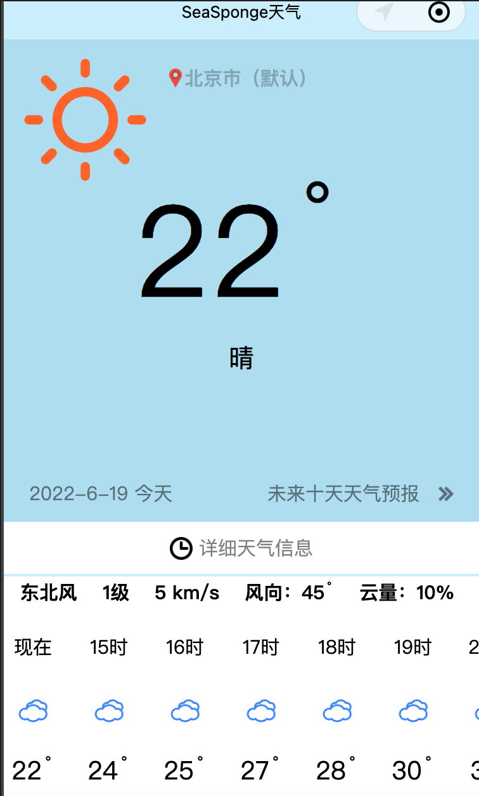

# SeaSponge天气
这个是我个人为了练习而做的一个天气预报微信小程序  

# SeaSponge Weather
This is a WeChat Mini Program I've made for practice with programming

## 功能
* 获取用户当前位置的实况天气
* 获得实况的详细天气数据（风向、湿度、能见度等）
* 获得24小时天气预报（每小时的数据）
* 获取未来九天的天气预报

## Functionalities

* Obtains the live weather from the user's current location
* Gets detailed data about weather (wind direction, humidity, visibility, etc.)
* Gets 24 hour weather forecast (data for each hour)
* Gets the future 9-day weather forcast

## 引用数据
SeaSponge天气微信小程序用到了以下的API  

* 和风天气（https://devapi.heweather.net）
* 腾讯位置服务 (https://apis.map.qq.com)

其次，SeaSponge天气中的天气图标也是运用了和风天气的图标

## References
The SeaSponge WeChat Mini-program uses the following APIs

* Heweather（https://devapi.heweather.net）
* Tencent location services (https://apis.map.qq.com)

Also, the weather icons in SeaSponge uses the images from Heweather

## Preview

{ width=50% }
